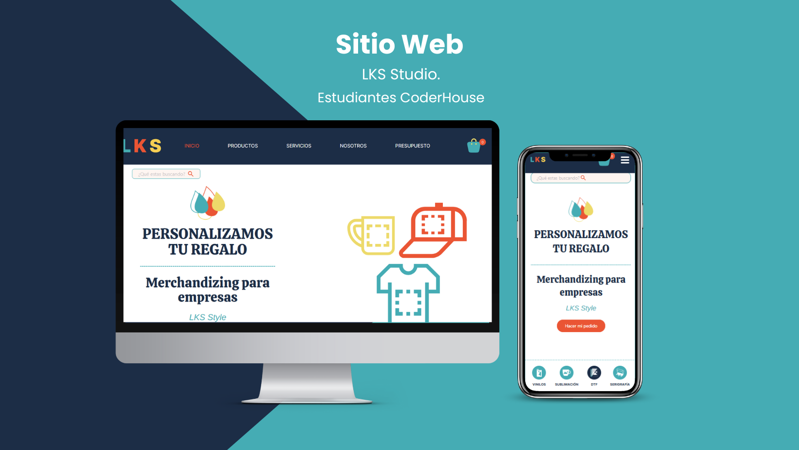
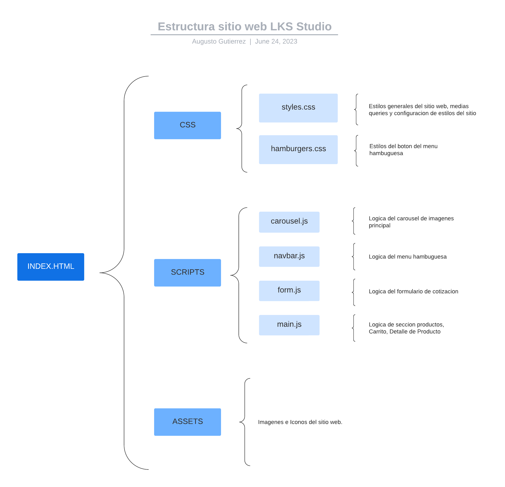

# Sitio Web LKS Studio

## Introduccion

Este sitio web ha sido desarrollado en colaboración con un equipo de 6 estudiantes, compuesto por 3 diseñadores UX/UI, 2 desarrolladores web frontend y 1 community manager. Todos ellos fueron seleccionados por el equipo de reclutadores de CoderHouse para participar como practicantes en un proyecto freelance destinado a emprendimientos y ONGs. El objetivo de este proyecto es aplicar los conocimientos adquiridos durante su formación en CoderHouse.

El sitio web pertenece a un emprendimiento argentino especializado en vinilos, sublimaciones, DTF y serigrafías, ubicado en la provincia de Córdoba. El equipo está liderado por Lucas Martín Moyano y su esposa; Paola Lucero Petinari, dos personas valientes y emprendedoras comprometidas en ofrecer un servicio de calidad superior a sus clientes.

## Estructura del sitio web
 
La construcción de este sitio web sigue una metodología 'desktop first', adaptándose posteriormente a diferentes tamaños de pantalla. Se han establecido cinco puntos de quiebre en 992px, 850px, 768px, 576px y 450px respectivamente.

La estructura del proyecto incluye un archivo principal llamado index.html que se enlaza con los archivos correspondientes. En la carpeta 'css' se encuentra el archivo style.css, el cual contiene los estilos de todo el sitio web. Además, hay un archivo llamado hamburgers.css, complementario para estilizar el botón del menú hamburguesa.

Asimismo, se ha creado una carpeta llamada 'scripts' que contiene el código JavaScript vanilla dividido en archivos separados con nombres representativos de su lógica interna. Esta separación se ha implementado con el objetivo de mantener el proyecto más organizado y facilitar su mantenimiento.

Por último, se ha creado una carpeta llamada 'assets' en la cual se encuentran las imágenes utilizadas en el sitio web.

## Stack Tecnologico 

### Lenguales
1. HTML5
2. CSS3
4. JAVASCRIPT 

### Framework
1. BOOTSTRAP 5.2.3

### Librerias
1. Tasty CSS-animated hamburgers
2. ToastifyJs
3. Axios

## Equipo de trabajo
[Federico Lacolla](https://www.linkedin.com/in/federico-lacolla ) - Diseñador UX/UI - [Portafolio](https://www.behance.net/federicola1dce/projects). 
[Julieta Vivoli](https://www.linkedin.com/in/julietavivoli/ ) - Diseñadora UX/UI - [Portafolio](https://www.behance.net/julietavivoli). 
[Ricardo Manzo](https://www.linkedin.com/in/manzo-ricardo/) - Desarrollador web frontend - [Portafolio](https://portfolio-ricardo-manzo.vercel.app/). 
[Augusto Gutierrez](https://www.linkedin.com/in/augusto-gutierrez/) - Desarrollador web frontend - [Portafolio](https://augustogutierrez.netlify.app/). 
[Selene D'Ambra]( https://www.linkedin.com/in/selenedambra/) - Diseñadora UX/UI. 
[Karen Tripoloni](https://www.linkedin.com/in/karen-tripoloni/) - Community Manager.
